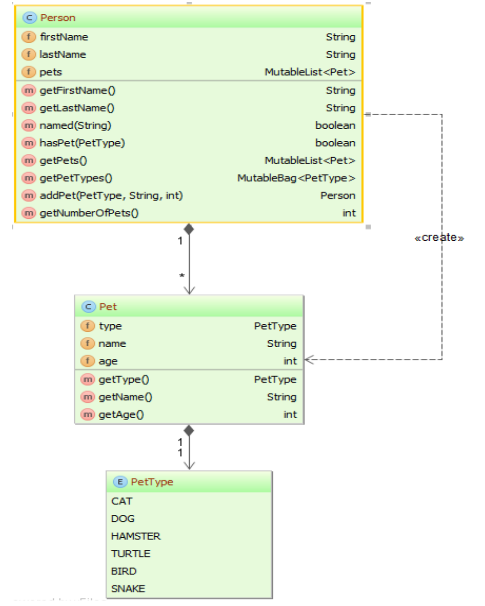

<h2>The Pet Kata</h2>

    <small>Created by <a href="http://thegeekettespeaketh.com">Charo Nuguid</a></small>

    <small>July 31, 2021</a></small>

## Pet Kata Domain

Below are the domain objects for the Pet kata.

    <small>Taken from <a href="http://eclipse.github.io/eclipse-collections-kata/pet-kata/#/">The Eclipse Collections: Pet Kata</a></small>

# Functions

## Functions

- Also known as a procedure or a subroutine
- Can take zero or more arguments
- See [Tour of Go](https://tour.golang.org/basics/4) for an example.

## Functions

- When two or more parameters share the same type, you can omit the type from all but the last
- See [Tour of Go](https://tour.golang.org/basics/5) for an example

## Functions

- Functions can also return multiple results
- See [Tour of Go](https://tour.golang.org/basics/6) for an example

## Exercise 1

Figure out how to get `pet-kata/Exercise1_test.go` to pass using what you have seen so far.

# The End